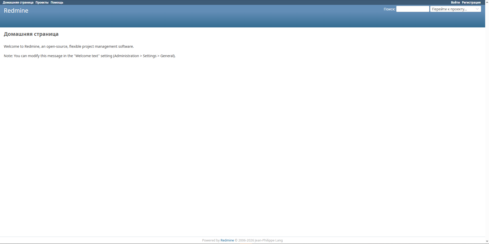

# Комплексный проект автоматизации: Terraform + Ansible + Docker (Redmine)

Данный репозиторий содержит реализацию двух этапов автоматизации развертывания веб-приложения Redmine в облачной инфраструктуре Yandex Cloud. Проект демонстрирует связку подходов **Infrastructure as Code (IaC)** и **Configuration Management**.

---

## 🛠 Проект №3: Инфраструктура как код (Terraform)
**Цель:** Полная автоматизация создания облачных ресурсов.

* **Файл конфигурации:** `main.tf`
* **Что автоматизировано:**
    * Развертывание виртуальной машины `redmine-server-automated` на платформе `standard-v3` (Intel Ice Lake).
    * Настройка сетевого интерфейса с публичным IPv4-адресом (`158.160.226.175`).
    * Управление ресурсами в зоне доступности `ru-central1-d`.
* **Подтверждение создания (Консоль Yandex Cloud):**


---

## 🏗 Проект №2: Управление конфигурацией (Ansible & Docker)
**Цель:** Автоматическая настройка ОС и деплой приложения через контейнеризацию.

* **Файлы конфигурации:** `playbook.yml`, `inventory.ini`
* **Что автоматизировано:**
    * **Установка Docker:** Автоматическое развертывание движка Docker на удаленном хосте.
    * **Деплой Redmine:** Запуск официального образа Redmine с пробросом портов (80:3000) и политикой автоматического перезапуска.
    * **Оркестрация:** Настройка выполняется одной командой без необходимости ручного ввода команд в терминале сервера.
* **Результат работы (Интерфейс приложения):**


---

## 🚀 Инструкция по запуску

Для повторения результата необходимо выполнить следующие шаги:

1.  **Инициализация провайдера:**
    ```bash
    terraform init
    ```
2.  **Создание инфраструктуры:**
    ```bash
    terraform apply -auto-approve
    ```
3.  **Развертывание приложения:**
    ```bash
    ansible-playbook -i inventory.ini playbook.yml
    ```

## ✅ Итоговый статус
* **Инфраструктура:** Создана автоматически через описание ресурсов в Terraform.
* **Сервис:** Настроен и развернут в Docker-контейнере с помощью Ansible.
* **Доступность:** Приложение успешно запущено и принимает запросы по внешнему IP-адресу созданной виртуальной машины.